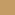
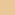
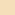
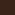
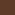

# UX / UI Design

## Palette

- **Nautical Blue:** Deep ocean color for primary backgrounds.
  -  Dark (`#053A5A`)
  -  Base (`#09527D`)
  -  Light (`#1F77A9`)
- **Parchment Tan:** Warm sandy color for primary text and light panels.
  -  Dark (`#C49C65`)
  -  Base (`#EAC796`)
  -  Light (`#F4DFB8`)
- **Terracotta Orange:** Sunburnt orange for borders, warnings, and accents.
  -  Dark (`#A1451E`)
  -  Base (`#D86938`)
  -  Light (`#E58A60`)
- **Seafoam Green:** Muted green from the ribbons, perfect for 'Safe Harbor' mapping and success states.
  -  Dark (`#457D65`)
  -  Base (`#6BA890`)
  -  Light (`#93C6B1`)
- **Ink Brown:** Dark aged brown for deep contrast, UI panel backgrounds, and borders.
  -  Dark (`#1E100A`)
  -  Base (`#3A2318`)
  -  Light (`#5E3B29`)

## Fonts

- **Header / Display Font:** `Beau Rivage` (Used for big titles, the Storm Glass, timer numbers, and all nautical thematic elements).  

- **Body / Utility Font:** `Quattrocento` (A highly legible, classic Roman serif used for all small UI text, inputs, buttons, and paragraphs).  

## Images

## Home Page

**Top Navigation Bar (Quick Access):**
Because we need to allow the user to change their settings quickly, these should live at the very top of the screen on the home page:
- **Top Left:** `[Captain's Profile Button]` (An icon of a pirate hat or wheel to open the weight/sex settings modal).
- **Top Right:** `[Storm Glass Button]` (An icon of a barometer to open the Buzz Target settings modal to adjust the target BAC limit).
- **Center Title:** "Blottolog" written in `Beau Rivage`.

**Primary View (The Hero Section):**
- **Course Plot (The Timer):** This is the focal point. A large UI component taking up the top half of the screen. It features the treasure map animation of the ship navigating toward the target. 
- **The Countdown:** Prominent countdown text below the map (e.g., "Next Port of Call in 34:12").

**Secondary View (The Graphic Manifest):**
- **Manifest (Active Drinks List):** Below the timer sits the manifest. Instead of a text list, drinks are highly graphic, represented by themed illustrations of bottles, tankards, and glasses (e.g., a rum bottle for liquor, a wooden mug for beer).
- **Layout:** The icons are centered in the view and aggregate horizontally side-by-side. Once the row runs out of horizontal room, they wrap and flow underneath into a new row (a flex-wrap layout). They contain very little to no text, relying purely on visual representation to show the 'Cargo' filling up.

**Primary Action:**
- **Add Drink Button:** A persistent Floating Action Button (FAB) at the bottom right/center. Visually, this could be a large, shiny gold Doubloon that opens the "Quick Add" drink sheet when tapped.

## Captain's Profile

## Manifest (Active Drinks List)

## Storm Glass (Buzz Target)

## Course Plot (Timer)
